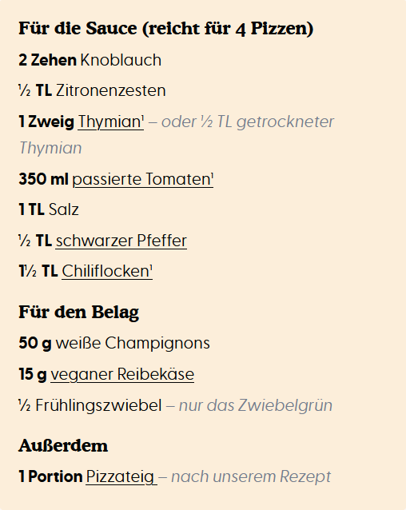
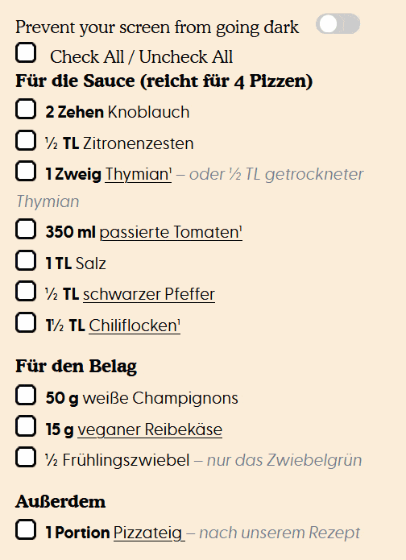

# Recipe Checkbox


> A firefox add-on to add checkboxes to recipes and also a wake lock so the screen does not turn of when cooking





## Supported Sites
[eat-this.org](eat-this.org)

[allrecipes.com](allrecipes.com)

[food.com](food.com)

[budgetbytes.com](budgetbytes.com)

[pinchofyum.com](pinchofyum.com)

## Features

- From a JSON file we load suported sites
- Adds checkboxes to all `<li>` elements inside a selector
- Adds a checkbox "Check all/ Deselect All" button
- Adds a Wakelock button to prevent screen from turning off when cooking

Create a pull request for new sites or create an [issue](/issues) with what sites you want to be added

## Add a new site

To add a new site to this add-on you have to do a few things:

1. ## Add site to `source/sites.json
```JSON
{
    "name": "food.com",
    "url": "food.com",
    "selector": ".ingredient-list"
}
```
here all available values for this object:

| Key               | Description                                                                                       | Optional
| -                 | -                                                                                                 | -
| name              | The name of the website                                                                           | false
| url               | the url without `https://` or `www`                                                               | false
| selector          | a selector that holds the list of ingrediants normally a ul with li children                      | false
| dontAddWakelock   | dont add wakelock this is only used if the site already has that, so you can disable this feature | true
| dontAddCheckboxes | dont add checkboxes this is only used if we want to add wakelock but site already has checkboxes  | true

2. ## If needed create custom css for that site (optional)

This add-on works with one JS file for all but we can load custom css files for each site supported. When building we automatically look for that and if the file exists we add it to the add-on

`sites/{name}/style.css`

`{name}` is the name we used in `sites.json`

## Getting started with development

### 🛠 Build locally

1. Clone
1. Run `pnpm install` to install all required dependencies
1. Run `pnpx tsx populate.ts` to create the `manifest.json` from `sites.json`
1. Run `pnpm build`

The build step will create the `distribution` folder, this folder will contain the generated extension.

### 🏃 Run the extension

Using [web-ext](https://extensionworkshop.com/documentation/develop/getting-started-with-web-ext/) is recommended for automatic reloading and running in a dedicated browser instance. Alternatively you can load the extension manually (see below).

1. Run `pnpm watch` to watch for file changes and build continuously
1. Run `npm install --global web-ext` (only only for the first time)
1. In another terminal, run `web-ext run -t chromium`
1. Check that the extension is loaded by opening the extension options ([in Firefox](media/extension_options_firefox.png) or [in Chrome](media/extension_options_chrome.png)).

#### Manually

You can also [load the extension manually in Chrome](https://www.smashingmagazine.com/2017/04/browser-extension-edge-chrome-firefox-opera-brave-vivaldi/#google-chrome-opera-vivaldi) or [Firefox](https://www.smashingmagazine.com/2017/04/browser-extension-edge-chrome-firefox-opera-brave-vivaldi/#mozilla-firefox).

## Extensions created using this template

- [notlmn/copy-as-markdown](https://github.com/notlmn/copy-as-markdown) - Browser extension to copy hyperlinks, images, and selected text as Markdown.
